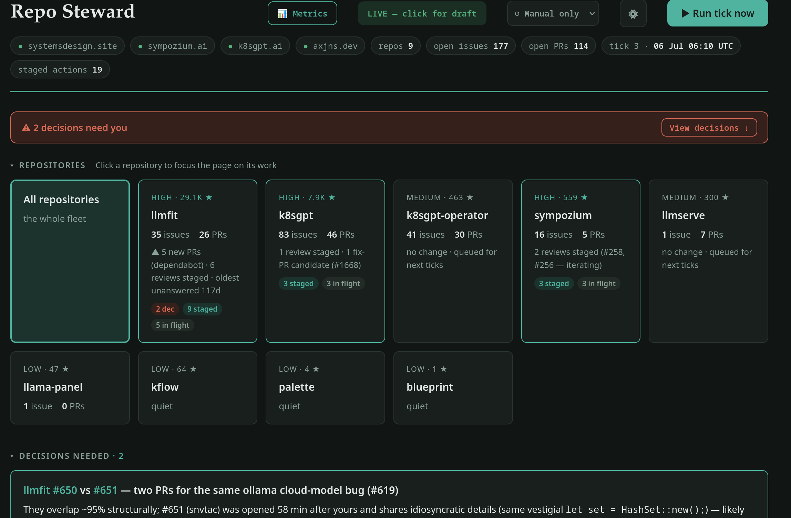

<p align="center">
  
</p>

# Repo Steward

> **An autonomous agent for open-source repository management.**

[](LICENSE)
[](#ai-backends)

Repo Steward is an agent that runs the operational side of maintaining
open-source repositories — triaging issues, reviewing pull requests across
multiple iterations, authoring bug-fix PRs, and watching your project websites
— on a schedule or a button press, keeping a live dashboard of what's happening
and escalating only tie-breaks and design decisions to you.

Built for the maintainer whose day disappears into pasting PR diffs into a
chat window: the steward does that loop autonomously, across every repository
you give it, and shows its work.

- **Draft mode by default** — every review and reply is staged for your
  approval until you flip the live toggle; nothing speaks for you until it has
  earned it.
- **One-click control** — run a tick, approve a staged action, or go live from
  the dashboard; approvals post under *your* GitHub auth because you clicked.
- **Hard guardrails** — never merges, never closes, never force-pushes.
- **Shows its work** — per-repo queues, staged action texts, token/cost
  metrics, trend lines, and uptime cards, all served from one local process.

<p align="center">
  
</p>

## How it works

```
systemd timer (hourly)
        │
        ▼
claude -p "execute one steward tick"     ← headless Claude Code session
        │
        ├─ sync: gh polls each repo since last cursor
        ├─ triage new issues → classify, label, draft substantive replies
        ├─ review PRs → verdicts: approve-recommend / iterate / escalate
        ├─ delta re-review PRs whose authors pushed since last review
        ├─ author fix PRs for confirmed bugs (own clones, tests included)
        ├─ escalate tie-breaks to escalations.md — never blocks on them
        └─ write ledgers + metrics, regenerate dashboard.html
                                              │
                                              ▼
                            server.py (systemd, port 8377)
                            dashboard + Run-tick / Approve buttons
```

There is no daemon and no database: continuity comes from plain JSON ledgers
in `state/`, so every tick is a fresh, stateless session that picks up exactly
where the last one stopped. Everything is inspectable and editable with a text
editor.

## Guardrails

- **Never merges, closes, or force-pushes.** Terminal states belong to you.
  These are denied at the Claude Code permission layer
  (`.claude/settings.json`), not just in the prompt.
- **Draft mode first.** Out of the box, nothing is posted to GitHub — every
  would-be review/reply is staged on the dashboard so you can calibrate the
  steward's judgment before it speaks on your repos. Go live with the mode
  toggle on the dashboard (or edit `mode:` in `config.yaml` — same thing).
- **Untrusted-content aware.** Issue/PR bodies are treated as data; the
  playbook instructs the steward to ignore embedded instructions and flag
  manipulation attempts. Contributor code is never executed on your shell.
- **Signed output.** In live mode every posted comment carries a signature
  from your config, so bot output is always auditable.
- **Bounded ticks.** Work per tick is capped (`limits` in config); a large
  backlog drains over days instead of producing one enormous, unreviewable burst.

## AI backends

The tick is an *agentic session* — it runs `gh`, edits ledgers, writes files —
so backends are headless coding-agent CLIs, selected at install time:

```bash
./install.sh                                            # Claude Code (default)
STEWARD_ENGINE=codex ./install.sh                       # OpenAI Codex CLI
STEWARD_ENGINE=gemini ./install.sh                      # Gemini CLI
STEWARD_ENGINE=opencode STEWARD_MODEL=ollama/qwen3 ./install.sh   # local models
STEWARD_ENGINE=custom STEWARD_ENGINE_CMD='my-agent --prompt "$PROMPT"' ./install.sh
```

- **Local / OpenAI-compatible providers** come in two flavors: run
  [opencode](https://opencode.ai) against Ollama/LM Studio/any provider it
  supports, or keep the Claude Code engine and point it at a proxy
  (`ANTHROPIC_BASE_URL` + [LiteLLM](https://github.com/BerriAI/litellm) routes
  to OpenAI, Bedrock, Vertex, or local models without any steward changes).
- **Caveats for non-Claude engines**: the merge/close/force-push *permission
  deny layer* ships as `.claude/settings.json`, which only Claude Code
  enforces — on other engines the playbook's guardrails still instruct, but
  nothing mechanically blocks; configure your engine's own sandbox/approval
  settings accordingly. Token/cost capture in `usage.jsonl` is currently
  Claude-only (other engines don't emit a usage envelope headlessly); the
  metrics page degrades gracefully. Engines other than Claude Code are
  lightly tested — reports and PRs welcome.

## Why not a general-purpose agent harness?

A reasonable question: agent harnesses and orchestration frameworks (Hermes,
OpenClaw, Pi, and the growing rest) already give you scheduling, tool use,
memory, and multi-agent coordination. Why hand-roll systemd + `gh` + JSON
files instead of building on one?

Because for *this* job the harness is the part you'd spend your time fighting,
and the properties that matter here come from deliberately **not** having one:

- **The state is plain files, not a runtime.** Every tick is a stateless,
  resumable `claude -p` invocation; continuity lives entirely in
  `state/<repo>.json`, `metrics.jsonl`, and `escalations.md` — versioned,
  greppable, and editable with a text editor. There's no daemon holding
  in-memory state, no database to migrate, no orchestration server to keep
  alive. A harness adds a stateful layer you now have to run, observe, and
  trust; here, if the machine reboots mid-tick, the next tick just re-reads the
  cursor and continues.

- **The trust surface is small enough to read in an afternoon.** The whole
  system is a handful of readable files: one playbook, one ~250-line stdlib
  Python server, one bash wrapper, one uptime probe. For software that acts on
  your repos under your GitHub identity, "you can audit all of it" is a
  feature, not a limitation.

- **Guardrails sit at the OS boundary, not inside a framework's config.**
  "Never merge, close, or force-push" is a `gh` permission deny-list enforced
  by Claude Code's sandbox — not a prompt instruction or a policy plugin a
  harness update could quietly change. Fewer moving parts between the intent
  and the enforcement.

- **The product is the human in the loop, not autonomy.** Draft mode,
  approve-to-post, escalate-don't-decide — the design optimizes for doing
  *less* on its own until you say otherwise. Most harnesses optimize the
  opposite direction; you'd be turning features off.

- **No lock-in to one harness's abstractions.** The tick engine is already
  swappable (`claude` / `codex` / `gemini` / `opencode` / `custom`). If you
  *want* a harness, point `STEWARD_ENGINE=custom` at it and the steward's
  file-based contract still holds. This isn't anti-harness — it's
  harness-agnostic, with the orchestration kept boring on purpose.

The honest tradeoff: a real harness gives you sophisticated multi-agent
planning, shared memory, and a tool ecosystem this doesn't have. Repo Steward
is a *steward*, not a general agent — a narrow job with strong guarantees. When
the job needs a fleet of coordinating agents, reach for the harness. When it
needs to reliably keep your PRs moving without becoming another system to
operate, reach for this.

## Requirements

- A headless agent CLI (see backends above; default
  [Claude Code](https://claude.com/claude-code)), authenticated
- [gh](https://cli.github.com/) CLI, authenticated with push access to your repos
- Linux with a systemd user session, `python3`, `jq`

## Install

```bash
git clone https://github.com/<you>/repo-steward && cd repo-steward
cp config.example.yaml config.yaml   # edit: your repos, signature, limits
./install.sh                         # or --no-timer to only tick manually
```

Then either wait for the first scheduled tick or start one now:

```bash
systemctl --user start repo-steward.service
tail -f logs/tick.log
```

Open **http://localhost:8377/** — the dashboard shows decisions needing you,
staged actions with full text, per-repo queues, and (after a few ticks)
trend lines. It auto-refreshes; from other devices on your network use
`http://<host-ip>:8377/` (open the port in your firewall if needed).

Pin a model or change cadence via env at install time:

```bash
# every half hour on a strong model
STEWARD_MODEL=claude-opus-4-8 STEWARD_CADENCE="*-*-* *:07,37:00" ./install.sh
# or one bigger tick each morning (raise `limits` in config.yaml to match)
STEWARD_CADENCE="*-*-* 07:00:00" ./install.sh
```

## Metrics

**http://localhost:8377/metrics.html** tracks the steward itself:

- **Tokens & cost per tick** — every tick runs through `tick.sh`, which
  captures the Claude Code usage envelope (input/output/cache tokens, cost,
  duration) into `usage.jsonl`.
- **Attention by repo** — cumulative steward actions per repo, the proxy for
  where the steward's effort goes (token usage is measured per tick, not per
  repo — one session works all repos).
- **Per-repo trends** — open issues/PRs over time from `metrics.jsonl`
  snapshots, plus a Δ-since-baseline table, so you can see which repos are
  heating up and whether the backlog is actually shrinking.

## Site uptime

Add a `sites:` block to config.yaml (see the example) and the installer
enables a token-free probe (`uptime_check.py`, every 5 minutes). Sites get
live status chips on the dashboard and 24h-uptime/latency cards on the
metrics page. A site is declared down after two consecutive failed probes;
the transition is logged to `incidents.jsonl` and escalated, and the next
steward tick investigates the linked repo (recent commits, failed deploy
workflows) — probes cost nothing, tokens are only spent when something
actually breaks.

## The dashboard controls

- **Run tick now** — starts a tick on demand (refused while one is running).
  A progress bar and toasts show elapsed time, an ETA, and which repo is being
  worked; the board auto-refreshes when the tick completes.
- **Mode toggle** — flip draft ⇄ live (rewrites `config.yaml`).
- **Schedule** — `Manual only / Hourly / Every 6h / Daily / Weekly`;
  live-configures the systemd timer. Ticks stay button-triggerable at any
  cadence.
- **⚙ Tick size** — the per-run work caps (substantive + light items). Raise
  for a bigger daily sweep, lower for cheaper, more frequent ticks. Applies to
  the next tick, so it's safe to change while one is running.
- **Approve & post** — appears on each staged action. Executes it via `gh`
  under *your* auth — clicking is you acting, which is why it works even in
  draft mode. Executed actions are stamped and can never double-post; the
  audit trail is `approvals.jsonl`.

Buttons appear only when the page is served by `server.py`; static copies of
the dashboard are read-only.

## Files

| path | what | in git? |
|---|---|---|
| `STEWARD.md` | the tick playbook the agent follows — edit to change behavior | yes |
| `server.py` | dashboard server + approve/tick API | yes |
| `install.sh` | generates the systemd user units | yes |
| `config.yaml` | your repos, mode, limits, signature | no (yours) |
| `state/<repo>.json` | per-repo ledger: every item's status, verdict, staged actions | no |
| `escalations.md` | decisions parked for you | no |
| `metrics.jsonl` | one snapshot per repo per tick → trends | no |
| `logs/tick.log` | full output of every tick | no |

## Operating it

```bash
systemctl --user stop repo-steward.timer      # pause future ticks
systemctl --user start repo-steward.timer     # resume
systemctl --user start repo-steward.service   # one tick, now
journalctl --user -u repo-steward.service     # tick history
```

Uninstall: `systemctl --user disable --now repo-steward.timer repo-steward-dash.service repo-steward-uptime.timer`
and delete the `repo-steward*` unit files from `~/.config/systemd/user/`.

## Costs & cadence

Each tick is a headless Claude Code session doing real review work — budget
accordingly. The defaults (hourly, 4 substantive + 12 light items) suit an
actively maintained portfolio; quiet repos cost almost nothing since a
no-change tick exits after the sync. Lengthen the cadence or shrink `limits`
for a lighter footprint.

## License

MIT
