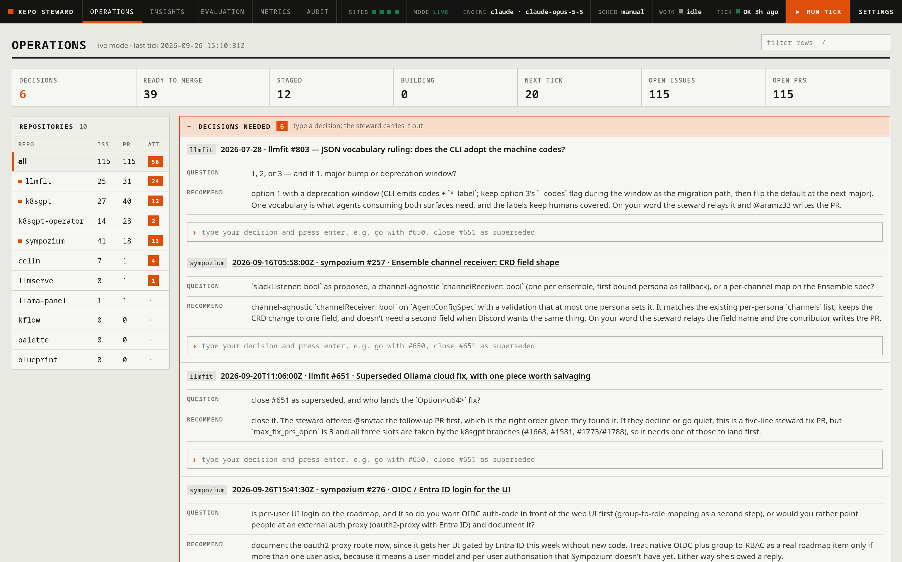

<p align="center">
  
</p>

# Repo Steward

> **An autonomous agent for open-source repository management.**

[](LICENSE)
[](#ai-backends)

Repo Steward is an agent that runs the operational side of maintaining
open-source repositories — triaging issues, reviewing pull requests across
multiple iterations, joining repository discussions, authoring bug-fix PRs, and
watching your project websites
— on a schedule or a button press, keeping a live dashboard of what's happening
and escalating only tie-breaks and design decisions to you.

Built for the maintainer whose day disappears into pasting PR diffs into a
chat window: the steward does that loop autonomously, across every repository
you give it, and shows its work.

- **Draft mode by default** — every review and reply is staged for your
  approval until you flip the live toggle; nothing speaks for you until it has
  earned it.
- **You are the terminal state** — the steward never merges or closes on its
  own judgment. A merge comes from your dashboard click, a typed decision, or
  a merge rule you wrote down (see [Good to merge](#the-good-to-merge-rule)),
  executed under *your* GitHub auth because *you* acted.
- **Decides what to build, then builds it** — the Insights sweep ranks open
  issues by value, readiness and effort; click **Build** on one and the
  steward implements it and opens a PR.
- **Decide in a sentence** — type a free-text decision on any escalation and
  press Enter; a focused executor interprets it and carries it out.
- **Shows its work honestly** — progress and ETAs derive from artifacts on
  disk and GitHub facts, never from the model's self-reporting; plus per-repo
  queues, staged action texts, token/cost metrics, trends, and uptime cards.

<p align="center">
  
</p>

## Quick links

| Get running | Use it daily | Understand it | Operate it |
|---|---|---|---|
| [Requirements](#requirements) | [The dashboard](#the-dashboard) | [How it works](#how-it-works) | [Operating it](#operating-it) |
| [Install](#install) | [Decisions & approvals](#decisions--approvals) | [Guardrails](#guardrails) | [Metrics](#metrics) |
| [AI backends](#ai-backends) | [Site uptime](#site-uptime) | [Files](#files) | [Costs & cadence](#costs--cadence) |
| | | [Why not an agent harness?](#why-not-a-general-purpose-agent-harness) | |

---

## Get running

### Requirements

- A headless agent CLI (see [backends](#ai-backends); default
  [Claude Code](https://claude.com/claude-code)), authenticated
- [gh](https://cli.github.com/) CLI, authenticated with push access to your repos
- Linux with a systemd user session, `python3`, `jq`

### Install

```bash
git clone https://github.com/<you>/repo-steward && cd repo-steward
cp config.example.yaml config.yaml   # edit: your repos, signature, limits
./install.sh                         # or --no-timer to only tick manually
```

Then either wait for the first scheduled tick or start one now:

```bash
make tick    # run one tick now
make logs    # follow it
```

`make help` lists every verb (`serve`, `start`, `status`, `open`,
`timer-on/off`, `uninstall`, …) — the friendly front door to the systemd units.

Open **http://localhost:8377/** — the dashboard shows decisions needing you,
staged actions with full text, per-repo queues, and (after a few ticks)
trend lines. It auto-refreshes; from other devices on your network use
`http://<host-ip>:8377/` (open the port in your firewall if needed).

Pin a model or change cadence via env at install time:

```bash
# every half hour on a strong model
STEWARD_MODEL=claude-opus-5 STEWARD_CADENCE="*-*-* *:07,37:00" ./install.sh
# or one bigger tick each morning (raise `limits` in config.yaml to match)
STEWARD_CADENCE="*-*-* 07:00:00" ./install.sh
```

`STEWARD_MODEL` is baked into the systemd unit and handed to the engine as
`--model` on every tick. On the default Claude Code engine, use either the
full ID (`claude-opus-5`, `claude-sonnet-5`, `claude-haiku-4-5`) or an alias
(`opus`, `sonnet`, `haiku`) that tracks the newest model in that family; leave
it unset to take the CLI's own default. Switch the backend later from the
provider selector in the dashboard header; switching providers clears the old
provider's model pin. Re-run the installer to set a new model pin. Every
install rewrites the unit from the environment you hand it, so an omitted
variable is *not* carried over from the
previous install: `STEWARD_MODEL` reverts to unpinned and `STEWARD_ENGINE`
reverts to `claude`. Pass both whenever you mean to keep both:

```bash
STEWARD_MODEL=claude-opus-5 ./install.sh   # Opus 5 on Claude Code
./install.sh                               # no model pin, engine back to claude
STEWARD_ENGINE=opencode STEWARD_MODEL=ollama/qwen3 ./install.sh   # keep both
```

### GitHub token

The tick and dashboard shell out to `gh`, so they need your GitHub credential
in an environment systemd can see — your shell rc is never sourced there. The
installer snapshots the token into `~/.config/repo-steward/env` (mode `0600`,
read as `GITHUB_TOKEN` by both units) and never into the unit files
themselves, where `systemctl show` would expose it.

By default the installer reads `GH_TOKEN`, falling back to `GITHUB_TOKEN`. If
your token lives under a custom name (e.g. `GITHUB_TOKEN_REPO_STEWARD` in
`~/.zshrc`), point the installer at it:

```bash
source ~/.zshrc   # or otherwise export the variable in this shell
STEWARD_GITHUB_TOKEN_VAR=GITHUB_TOKEN_REPO_STEWARD ./install.sh
```

The usual re-run rule applies: pass `STEWARD_ENGINE` / `STEWARD_MODEL` again
whenever you mean to keep them. With no token exported, the installer falls
back to `gh`'s stored auth (`~/.config/gh/hosts.yml`, which the service finds
via `HOME`, including keyring-backed credentials) — but an rc-only variable
reaches neither path, which is what the snapshot is for. Re-run the installer
after rotating the token; the snapshot is not live.

Scope-wise the token needs at least `repo`, plus `workflow` if the steward
should touch `.github/workflows` files — without it, those merges stay manual.

To confirm what the *next* tick will use, read the unit rather than the log —
`logs/tick.log` only gains a `=== tick <ts> engine=<name> ===` header when a
tick finishes, so just after an install its tail still describes the old setup:

```bash
systemctl --user show repo-steward.service -p Environment
```

That is separate from your own Claude Code sessions, which the steward never
touches — switch those with `/model opus` inside a session, or
`claude --model claude-opus-5` when launching one.

### AI backends

The tick is an *agentic session* — it runs `gh`, edits ledgers, writes files —
so backends are headless coding-agent CLIs, selected at install time:

```bash
./install.sh                                            # Claude Code (default)
STEWARD_ENGINE=codex ./install.sh                       # OpenAI Codex CLI
STEWARD_ENGINE=gemini ./install.sh                      # Gemini CLI
STEWARD_ENGINE=muse ./install.sh                        # Muse Code
STEWARD_ENGINE=opencode STEWARD_MODEL=ollama/qwen3 ./install.sh   # local models
STEWARD_ENGINE=custom STEWARD_ENGINE_CMD='my-agent --prompt "$PROMPT"' ./install.sh
```

- **Local / OpenAI-compatible providers** come in two flavors: run
  [opencode](https://opencode.ai) against Ollama/LM Studio/any provider it
  supports, or keep the Claude Code engine and point it at a proxy
  (`ANTHROPIC_BASE_URL` + [LiteLLM](https://github.com/BerriAI/litellm) routes
  to OpenAI, Bedrock, Vertex, or local models without any steward changes).
- **Caveats for non-Claude engines**: the merge/close/force-push *permission
  deny layer* ships as `.claude/settings.json`, which only Claude Code
  enforces — on other engines the playbook's guardrails still instruct, but
  nothing mechanically blocks; configure your engine's own sandbox/approval
  settings accordingly. Token/cost capture in `usage.jsonl` is currently
  Claude-only (other engines don't emit a usage envelope headlessly); the
  metrics page degrades gracefully. Engines other than Claude Code are
  lightly tested — reports and PRs welcome.

---

## Use it daily

### The dashboard

Every page shares one top bar. On the left are the pages: **Operations**,
**Insights**, **Evaluation**, **Metrics** and **Audit**. On the right is live
status: site uptime, **Mode** (LIVE or DRAFT; click to switch, with a
confirmation), the **Engine** and model, the **Schedule**, and the last
**Tick** result, or elapsed time while one runs.

**Work** (or <kbd>w</kbd>, or `/dashboard.html#work`) is the steward's queue:
what is running now, with each run's latest steps, and what is waiting (typed
decisions, queued builds, decisions that need your clarification). A tick or
the decision runner holds the ledgers while it runs, so merges, posts and
dismissals wait. The cell turns orange and reads **LOCKED**, the affected
buttons disable with the reason, and Operations shows a banner saying what is
holding them. Sweeps, evaluations and builds never block a merge.

- **▶ Run tick** starts a tick on demand. While one runs, a progress strip
  appears under the bar and **■ Stop** replaces the button. The progress is
  *deterministic*: it counts chunks the tick provably completed (repo ledgers,
  metrics, dashboard writes, from file mtimes, never the model's self-reported
  position), and the ETA is the median of real per-chunk timings from past
  ticks (`timings.jsonl`). Stopping requires confirmation, terminates only the
  tick service, keeps partial local artifacts, and cannot undo anything already
  posted to GitHub. The cancellation is recorded in the audit log.
- **Settings** (or <kbd>,</kbd>) holds everything else. *Engine* switches the
  CLI for ticks, sweeps and builds. *Schedule* is manual, hourly, every 6 hours,
  daily or weekly, and live-configures the systemd timer. *Sign-off* toggles
  the signature on posted comments. *Tick size* sets the per-run work caps.
  *Watched resources* is the per-repo matrix of issues, PRs and discussions,
  plus each repo's priority. *Theme* chooses light, dark or the system setting
  for this browser. Everything except the schedule, sign-off and theme applies
  from the next tick, so it's safe to change during one.

**Operations** opens with a readout of what waits on you, a repository rail
(click a repo to focus every panel on it; the orange number is how many items
need you there) and a row filter (<kbd>/</kbd>). Its panels:

- **Decisions needed**: each escalation has a command line. Type what you
  want done and press Enter. See [Decisions & approvals](#decisions--approvals).
- **Ready for your final look**: the recommend-to-merge shortlist, checked live
  against GitHub. PRs already merged or closed are struck through, and approvals
  at the current head show their age. **Merge** posts the staged review if it
  is still unposted, then merges. **Review** shows the staged text, and
  **Dismiss** drops the item without posting.
- **Builds**: the Insights build queue, with each build's state and PR.
- **Staged replies**: everything else the steward drafted. **View** reads it
  and **Post** sends it under your account.
- **Next tick** is the plan: what the steward intends to do next and why.
  **Last tick** is the record of what it actually did.

Panels collapse by clicking their header, and stay that way in this browser.

**Keyboard.** <kbd>g</kbd> then <kbd>o</kbd> / <kbd>i</kbd> / <kbd>e</kbd> /
<kbd>m</kbd> / <kbd>a</kbd> switches pages. <kbd>j</kbd> and <kbd>k</kbd> move
between rows, and <kbd>enter</kbd> opens the selected row (Review, View, the
decision box, a theme's brief, an event's raw JSON). <kbd>/</kbd> filters,
<kbd>,</kbd> opens settings, <kbd>w</kbd> the work queue, and <kbd>?</kbd> lists every shortcut.

Controls appear only when the page is served by `server.py`; static copies are
read-only.

### Decisions & approvals

Everything that touches GitHub under your name happens because you acted, and
every action lands in the `approvals.jsonl` audit trail:

- **Merge** (Ready table) — executes the staged review via `gh`
  under your auth, then merges (method from `merge_method:` in config, else
  the first the repo allows: squash → merge → rebase). Works even in draft
  mode: clicking is you acting. If strict branch protection says the approved
  PR is behind `main`, the same click uses GitHub's update-branch endpoint,
  then queues auto-merge while the refreshed checks run. That result is
  reported as **queued**, not merged: the row stays in Ready marked *auto-merge
  queued* until GitHub merges it. If main moves again first, GitHub's
  auto-merge stalls on the out-of-date branch; the row then reads *queued ·
  behind main* and the button becomes **Update**. A review staged for a commit
  the PR has since moved past (a bot re-pin, a rebase) is skipped as superseded
  rather than posted against the wrong commit. This is limited to that
  explicit click; a background tick never writes to a contributor branch.
- **Typed decisions** (Decisions section) — type e.g. *"go with #650, close
  #651 as superseded"* and press Enter. The server records it to
  `decisions.jsonl` and runs `decide.sh`: a focused engine session that
  interprets your text and carries it out — comments, labels, ledger updates.
  Explicit merge/close instructions are executed by the server itself (the
  engine session stays mechanically denied those verbs; it *requests* them
  from `/api/terminal`, which answers decision executors and narrowly verified
  live-tick auto-merges of unchanged steward-approved PRs after the configured
  grace period). If your text is too ambiguous to act on safely, the entry comes
  back asking for clarification instead of guessing. Decisions typed while a
  tick runs queue and drain as soon as the steward is free.
- **Dismiss** — drops a staged item without posting; recorded like everything
  else.

#### The good-to-merge rule

`merge_ready.py` merges without a click, under one standing rule you record
as a decision: squash-merge a PR when the steward's latest review is an
approval **on the current head** that ends "Good to merge", GitHub's review
decision is APPROVED, every check is green, the branch merges cleanly, and it
is not a critical feature change. A title starting `feat` or marked breaking
(`!`), or a major-version dependency bump, stays with you.

```bash
make merge-ready          # dry run: what would merge, and why the rest won't
make merge-ready MERGE=1  # squash-merge the eligible PRs
```

It uses `gh` only, with no model and no token cost, and refuses to run during a
tick or decision run. A branch behind a strict-protection base is updated
first. Where the repository allows it, GitHub auto-merge then finishes once
checks pass; otherwise the next run merges it (it remembers the update commit
in `.merge_ready_updates.json`, so the approval still counts). Every merge is
logged to `approvals.jsonl` and `audit.jsonl`. Because the phrase now
triggers a merge, the steward reserves "Good to merge" for PRs that truly are.

### The decision log

`audit.jsonl` is the append-only, serialisable record of everything anyone
decided or did — one JSON event per line, unified across every channel:
your dashboard clicks (approve/dismiss), typed decisions and their
executions, explicit merges/closes, config changes, tick runs, and the
steward's own actions (staged reviews, live posts, fix PRs, escalations,
observed outcomes). Steward events are written as structured lines to
`activity.jsonl` during a run and folded in when it ends, so the activity
you see on the dashboard is rendered from the same serialisable events the
log keeps forever.

**http://localhost:8377/audit.html** is the log's page (the **Audit** tab):
totals up top, then a table of every event newest-first grouped by day,
filterable by actor / event type / repo / day plus free-text search, failures
flagged. Click a row (or press <kbd>enter</kbd>) for its raw JSON. Two download buttons: the raw `audit.jsonl`
(the append-only file itself) or the currently filtered view as CSV.

Schema and event catalogue live in `audit.py`. Other ways to read it:
`make audit` (last events, pretty), `GET /api/audit?repo=&event=&limit=`,
or any jq one-liner — e.g. every terminal action ever taken:

```bash
jq -r 'select(.event=="terminal") | "\(.ts) \(.repo) \(.ref): \(.summary)"' audit.jsonl
```

An install that predates the log migrates its whole history once with
`make audit-backfill` — it converts `approvals.jsonl`, `decisions.jsonl`,
and `usage.jsonl` into the same format, idempotently (re-running never
duplicates an event).

### Metrics

**http://localhost:8377/metrics.html** tracks the steward itself:

- **Tokens & cost per tick** — every tick runs through `tick.sh`, which
  captures the Claude Code usage envelope (input/output/cache tokens, cost,
  duration) into `usage.jsonl`; decision-executor runs are captured too,
  tagged separately so they don't skew tick stats.
- **Attention by repo** — cumulative steward actions per repo, the proxy for
  where the steward's effort goes (token usage is measured per tick, not per
  repo — one session works all repos).
- **Per-repo trends** — open issues/PRs over time from `metrics.jsonl`
  snapshots, plus a Δ-since-baseline table, so you can see which repos are
  heating up and whether the backlog is actually shrinking.

### Insights: what to build next

The Insights page ranks what is most worth building across every configured
repository. Start a sweep with **Run build sweep** at the top of the page, or
`make insights`. It has three steps:

1. `insights.py prepare` reads the open issues and PRs from GitHub (read-only,
   with `gh`, and no model). It pre-ranks the issues on reactions,
   participants, recency, labels and repository priority, then fetches the
   full threads of the strongest ~50.
2. One model session follows `INSIGHTS.md` and writes a ranked list of
   **themes**. A theme is one buildable change grounded in one or more open
   issues, with a value score, readiness (`ready` / `needs-design` /
   `blocked`), effort, build cost, risk, and a build brief (goal, acceptance
   criteria, likely files, open questions). A single well-specified request can
   rank first. It does not need to recur across several issues.
3. `insights.py publish` rejects any theme that cites an issue or PR missing
   from the snapshot, then publishes `insights.json`. Issue titles, links and
   counts shown on the page are copied from the snapshot, not from the model.

A sweep only runs when started, and times out after 20 minutes by default
(`STEWARD_INSIGHTS_TIMEOUT_SEC`). A failed or rejected run leaves the last
published list in place.

**Build.** Open a theme and click **Build**. `build.sh` then runs one steward
session per queued theme, following `BUILD.md`. The session works in its own
clone under `work/builds/`, on branch `steward/build-<key>`, implements the
brief, runs the repository's tests, and opens a PR. It opens a draft PR if
something still fails. If an open question would change the design, it stops
and reports it instead of guessing. Builds never merge: merging stays with you
or `merge_ready.py`. The queue and results live in `builds.json` and are shown
on each theme. Output goes to `logs/build.log`, and runs launch as the
transient unit `repo-steward-build.service`. A build does not wait for a tick,
and ticks do not run builds.

This sweep and the self-evaluation below are independent of each other and of
ticks: each holds its own lock (`.insights.lock` / `.evaluation.lock`), so a
second start of the same job is refused whether it came from the dashboard or
`make`. Dashboard runs launch as the transient user unit
`repo-steward-insights.service` or `repo-steward-evaluation.service` with the
tick's engine settings, so they survive a dashboard restart; output goes to
`logs/insights.log` and `logs/evaluation.log`, and the button shows the last
outcome.

A running job can be stopped with **Cancel** beside its button, whether it was
started from the dashboard or with `make` — the script records its pid in the
lock, so a `make` run is signalled directly. Cancelling discards the run and
leaves the last published result in place. A running tick has the same control:
**Stop tick** appears next to the run button on the Operations page. Stopping a
tick is an interruption rather than a pause — finished work stands, work in
flight is lost, the board is not refreshed, and the audit log records it.

### Steward self-evaluation

Start a separate critical review of earlier steward judgments against later
maintainer actions, contributor responses, and repository outcomes with **Run
self-evaluation** at the top of the Evaluation page, or `make evaluate`.
It is read-only with respect to GitHub and the operational queue. Findings must
cite the original steward event plus later evidence; silence is never treated as
validation, and the steward's own approval is not independent review.

Validated reports are retained in `evaluations.jsonl`, with the latest in
`evaluation.json`. A bounded set of finding-backed, repository-specific lessons
is written to `lessons.json` and read by future ticks as fallible guidance that
cannot override current evidence or guardrails. View the dedicated section at
**http://localhost:8377/evaluation.html**.

### Site uptime

Add a `sites:` block to config.yaml (see the example) and the installer
enables a token-free probe (`uptime_check.py`, every 5 minutes). Sites get
a status dot each in the top bar's **Sites** cell (a down site is named in red)
and 24h-uptime/latency cards on the metrics page. A site is declared down after two consecutive failed probes;
the transition is logged to `incidents.jsonl` and escalated, and the next
steward tick investigates the linked repo (recent commits, failed deploy
workflows) — probes cost nothing, tokens are only spent when something
actually breaks.

---

## Understand it

### How it works

```
systemd timer or ▶ Run tick                 you, on the dashboard
        │                                   type a decision ⏎ / merge / build
        ▼                                                │
tick.sh ── drains typed decisions first                  ▼
        │                                   server.py (systemd, port 8377)
        ▼                                   records → decisions.jsonl
claude -p "execute one steward tick"        spawns decide.sh when idle
        │                                   executes gh actions under YOUR auth
        ├─ sync: gh polls each repo since last cursor
        ├─ triage new issues → classify, label, draft substantive replies
        ├─ join discussions → draft replies to unanswered threads (GraphQL)
        ├─ review PRs → verdicts: approve-recommend / iterate / escalate
        ├─ delta re-review PRs whose authors pushed since last review
        ├─ author fix PRs for confirmed bugs (own clones, tests included)
        ├─ escalate tie-breaks to escalations.md — never blocks on them
        ├─ write ledgers + metrics, regenerate dashboard.html
        └─ snapshot changed evidence into signals.jsonl for later insights
```

Alongside the tick, three paths run on their own schedule, or when you ask:
`insights.sh` (read GitHub, rank build candidates), `build.sh` (implement a
theme you clicked **Build** on and open a PR), and `merge_ready.py` (merge
what the good-to-merge rule allows).

There is no daemon and no database: continuity comes from plain JSON ledgers
in `state/`, so every tick is a fresh, stateless session that picks up exactly
where the last one stopped. Everything is inspectable and editable with a text
editor.

### Guardrails

- **The steward never merges, closes, or force-pushes on its own judgment.**
  Terminal states belong to you — reached only through your **Merge** click,
  an explicit typed decision, or the good-to-merge rule you recorded, all
  executed outside the agent under your auth and logged to `approvals.jsonl`.
  Builds open PRs and never merge them. For the agent sessions themselves the
  verbs are denied at the Claude Code permission layer
  (`.claude/settings.json`), not just in the prompt.
- **Draft mode first.** Out of the box, nothing is posted to GitHub — every
  would-be review/reply is staged on the dashboard so you can calibrate the
  steward's judgment before it speaks on your repos. Go live with the mode
  toggle on the dashboard (or edit `mode:` in `config.yaml` — same thing).
- **Untrusted-content aware.** Issue, PR, and discussion bodies are treated as data; the
  playbook instructs the steward to ignore embedded instructions and flag
  manipulation attempts. Contributor code is never executed on your shell.
  Typed dashboard decisions are the one *trusted* text channel — they come
  from you, on localhost.
- **Signed output.** In live mode every posted comment carries a signature
  from your config, so bot output is always auditable.
- **Bounded ticks.** Work per tick is capped (`limits` in config); a large
  backlog drains over days instead of producing one enormous, unreviewable burst.

### Files

The program is a handful of tracked files at the repo root; everything a
running install generates is gitignored (per-maintainer state). The tracked set:

| path | what | in git? |
|---|---|---|
| `STEWARD.md` | the tick playbook the agent follows — edit to change behavior | yes |
| `server.py` | dashboard server + approve / decide / terminal / tick API | yes |
| `assets/steward.css` | the one design system every page uses: tokens, light and dark themes, tables, controls | yes |
| `assets/steward-shell.js` | the shared top bar: navigation, live status, run/stop tick, mode, settings, keyboard shortcuts, dialogs | yes |
| `steward-controls.js` | Operations page behaviour: repo and text filters, decisions, merge/dismiss/post, collapsible panels | yes |
| `tick.sh` | headless-agent wrapper each tick runs through; captures usage + chunk timings | yes |
| `decide.sh` | the decision executor `server.py`/`tick.sh` spawn for typed decisions | yes |
| `audit.py` | decision-log schema, append/read helpers, history backfill | yes |
| `signals.py` | deterministic, deduplicating evidence collector for repository insights | yes |
| `insights.py` · `INSIGHTS.md` · `insights.sh` | GitHub fetch, ranking playbook, and validated publish for the build-candidate sweep | yes |
| `builds.py` · `BUILD.md` · `build.sh` | the Build button's queue, playbook, and runner (implements a theme, opens a PR) | yes |
| `merge_ready.py` | squash-merges PRs the steward signed off "Good to merge" that are not feature changes (`--merge`; dry run by default) | yes |
| `proactive.py` | retired idea-canvas queue; ticks still honour items already in `proactive.json` | yes |
| `evaluation.py` · `EVALUATION.md` · `evaluate.sh` | critically compare prior judgments with later outcomes and derive lessons | yes |
| `insights.html` · `evaluation.html` · `metrics.html` · `audit.html` | build candidates, self-evaluation, metrics, and decision-log pages | yes |
| `uptime_check.py` | token-free site probe the uptime timer runs | yes |
| `install.sh` | generates the systemd user units | yes |
| `Makefile` | convenience verbs over the units — `make help` | yes |
| `.claude/settings.json` | the merge / close / force-push permission deny layer | yes |
| `config.example.yaml` | starter config — copy to `config.yaml` | yes |
| `VOICE.example.md` | optional writing-style template — copy to `VOICE.md` | yes |

Generated per install, never committed:

| path | what | in git? |
|---|---|---|
| `config.yaml` | your repos, mode, limits, signature | no (yours) |
| `dashboard.html` | the live board — regenerated every tick | no |
| `state/<repo>.json` | per-repo ledger: every item's status, verdict, staged actions | no |
| `escalations.md` | decisions parked for you | no |
| `decisions.jsonl` | your typed decisions + their outcomes | no |
| `approvals.jsonl` | audit trail of every action taken under your auth | no |
| `audit.jsonl` · `activity.jsonl` | the unified decision log + the current run's slice of it | no |
| `metrics.jsonl` · `usage.jsonl` · `timings.jsonl` | snapshots, token/cost envelopes, per-chunk tick timings | no |
| `signals.jsonl` | append-only item, activity, and metric evidence with stable graph identities | no |
| `insights-input.json` · `insights.candidate.json` · `insights.json` | GitHub snapshot, untrusted candidate, and validated ranked themes | no |
| `builds.json` · `builds/` | build queue and per-build briefs and results | no |
| `proactive.json` · `proposals/` | selected-idea workflow state and local investigation briefs | no |
| `evaluation-input.json` · `evaluation.candidate.json` · `evaluation.json` | bounded evaluation context, untrusted candidate, and validated report | no |
| `evaluations.jsonl` · `lessons.json` | evaluation history and current evidence-backed tick guidance | no |
| `logs/tick.log` · `logs/decide.log` | full output of every tick / decision run | no |

### Why not a general-purpose agent harness?

A reasonable question: agent harnesses and orchestration frameworks (Hermes,
OpenClaw, Pi, and the growing rest) already give you scheduling, tool use,
memory, and multi-agent coordination. Why hand-roll systemd + `gh` + JSON
files instead of building on one?

Because for *this* job the harness is the part you'd spend your time fighting,
and the properties that matter here come from deliberately **not** having one:

- **The state is plain files, not a runtime.** Every tick is a stateless,
  resumable `claude -p` invocation; continuity lives entirely in
  `state/<repo>.json`, `metrics.jsonl`, and `escalations.md` — versioned,
  greppable, and editable with a text editor. There's no daemon holding
  in-memory state, no database to migrate, no orchestration server to keep
  alive. A harness adds a stateful layer you now have to run, observe, and
  trust; here, if the machine reboots mid-tick, the next tick just re-reads the
  cursor and continues.

- **The trust surface is small enough to read in an afternoon.** The whole
  system is a handful of readable files: one playbook, one ~600-line stdlib
  Python server, two bash wrappers, one uptime probe. For software that acts on
  your repos under your GitHub identity, "you can audit all of it" is a
  feature, not a limitation.

- **Guardrails sit at the OS boundary, not inside a framework's config.**
  "Never merge, close, or force-push" is a `gh` permission deny-list enforced
  by Claude Code's sandbox — not a prompt instruction or a policy plugin a
  harness update could quietly change. Fewer moving parts between the intent
  and the enforcement.

- **The product is the human in the loop, not autonomy.** Draft mode,
  approve-to-post, escalate-don't-decide — the design optimizes for doing
  *less* on its own until you say otherwise. Most harnesses optimize the
  opposite direction; you'd be turning features off.

- **No lock-in to one harness's abstractions.** The tick engine is already
  swappable (`claude` / `codex` / `gemini` / `muse` / `opencode` / `custom`). If you
  *want* a harness, point `STEWARD_ENGINE=custom` at it and the steward's
  file-based contract still holds. This isn't anti-harness — it's
  harness-agnostic, with the orchestration kept boring on purpose.

The honest tradeoff: a real harness gives you sophisticated multi-agent
planning, shared memory, and a tool ecosystem this doesn't have. Repo Steward
is a *steward*, not a general agent — a narrow job with strong guarantees. When
the job needs a fleet of coordinating agents, reach for the harness. When it
needs to reliably keep your PRs moving without becoming another system to
operate, reach for this.

---

## Operate it

### Operating it

The `make` targets wrap the systemd user units — run `make help` for the list:

```bash
make status      # dashboard / tick / timer state at a glance
make tick        # one tick, now
make insights    # rank what is worth building (GitHub read + one model session)
make build       # run builds queued from the Insights page
make merge-ready # dry run of the good-to-merge rule (MERGE=1 to act)
make timer-off   # pause scheduled ticks (dashboard stays up)
make timer-on    # resume them
make logs        # tail the tick log
make uninstall   # disable and stop every steward unit
```

These are thin wrappers over `systemctl --user` against the `repo-steward*`
units — run those directly if you prefer (`journalctl --user -u
repo-steward.service` for full tick history). After `make uninstall`, delete the
`repo-steward*` unit files from `~/.config/systemd/user/` to remove them fully.

### Costs & cadence

Each tick is a headless Claude Code session doing real review work — budget
accordingly. The defaults (hourly, 4 substantive + 12 light items) suit an
actively maintained portfolio; quiet repos cost almost nothing since a
no-change tick exits after the sync. Typed decisions spawn small focused
sessions, tracked in the same usage ledger. A build-candidate sweep costs about
one tick (roughly $2 on Opus), as does each Build; `merge_ready.py` is free. Lengthen the cadence or shrink
`limits` for a lighter footprint.

## License

MIT
